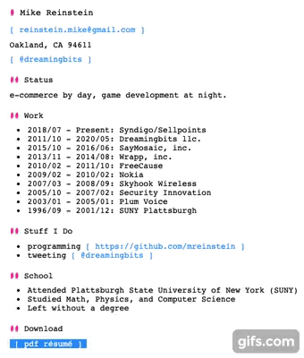

# text-animate

beautiful, animated, HTML typographic UI effects




## simple example

You can use commonjs (require) or es modules (import)

```javascript
import { header, controller } from 'text-animate'


const anim = controller()
const randSeed = Math.random()

const p5 = {
  color: [ 0, 0, 0 ],  // [ r, g, b ]
  duration: 300,
  delay: 0      // milliseconds to wait before animation starts
}
const h = header(document.querySelector('span'), p5)
anim.add(h)

anim.start()
```

More advanced usage examples available in `example/` and on my personal site: https://reinstein.me
